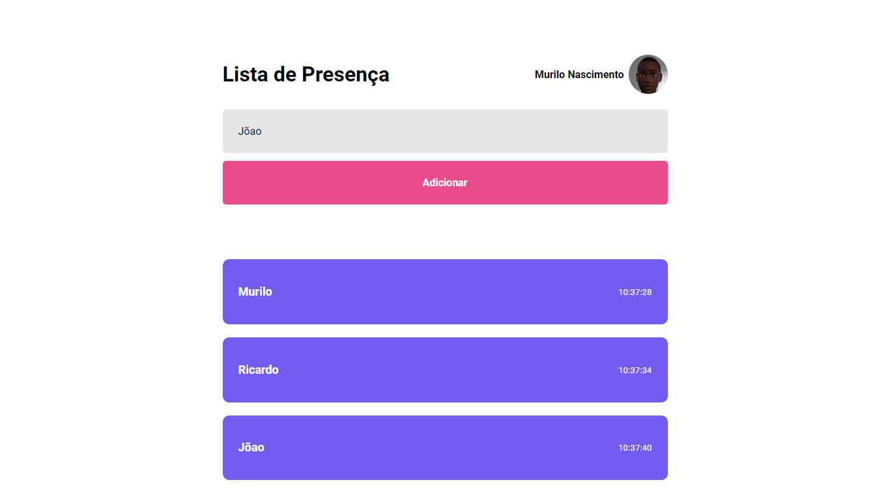

# Attendace List
Projeto Criado na Trilha Discover da Rocketseat - Módulo Fundamentos do ReactJS
## Deploy da aplicação

https://attendace-list.vercel.app/

## Tecnologias utilizadas

+ HTML5
+ CSS3
+ JavaScript
+ ReactJS

## Estrutura do site

+ Input: Seção onde é possível adicionar o nome da pessoa da lista de presença
+ Cards: Seção onde é possível ver o nome da pessoa adiciona e o horário em que foi adicionado

## Dark Theme

